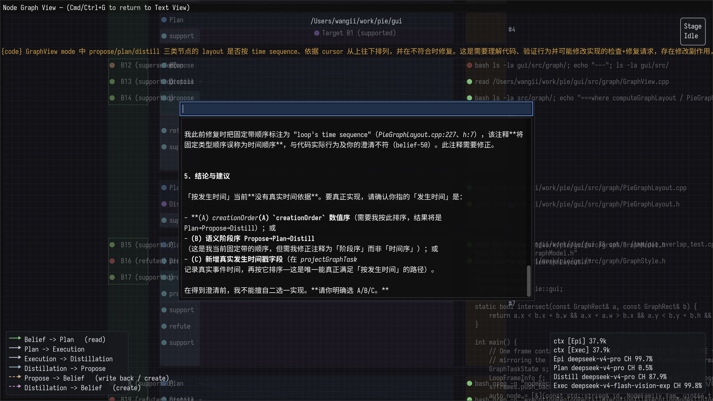
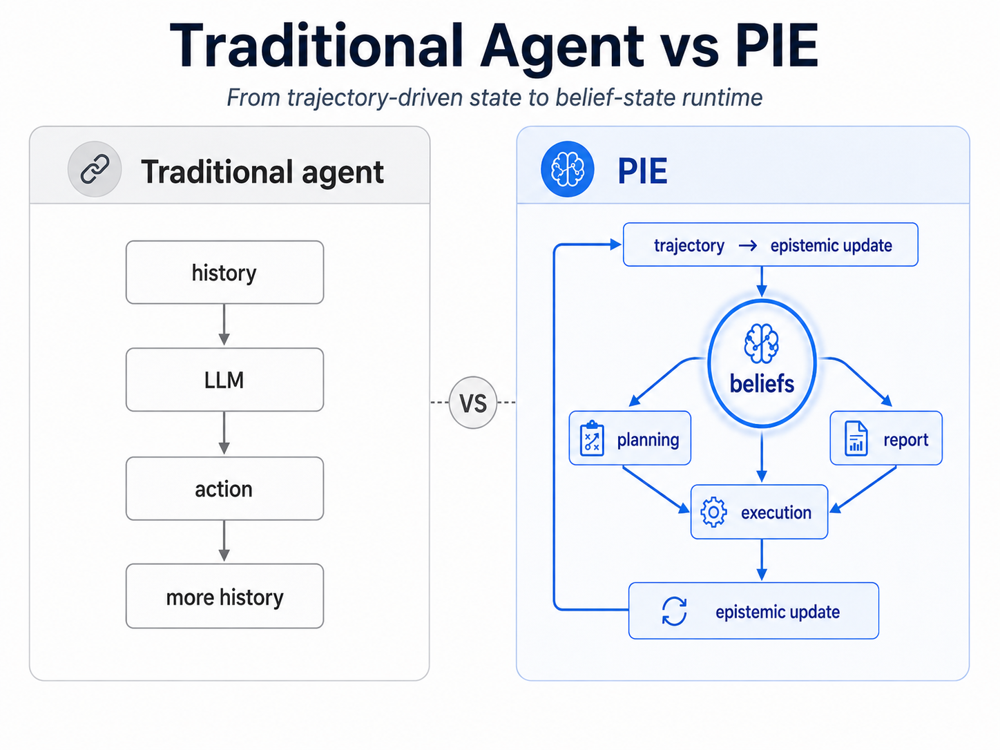

# Pie: Pi + Epistemology




PIE is an experimental coding-agent harness that makes the epistemic process itself an explicit runtime object. Rather than allowing one model invocation to freely mix hypothesis formation, investigation, interpretation and answer generation, PIE separates these cognitive operations and controls the information allowed to cross between them.

Pie 是一个以四阶段信念循环为核心、默认启用的可自我扩展编码智能体；其余 workspace 只提供通用支撑能力。
Pie is a self-extensible coding agent whose core is a default-enabled four-phase belief loop; the other workspaces only provide generic support.


- **四阶段信念循环（Four-phase belief loop）**：propose → planner → execution → distill → finalReport，由 ROLE_SPECS/TRANSITION_STEERS 单一权威源驱动，默认启用。The four phases (plus a batching planner step between propose and execution) are driven by the single source of truth ROLE_SPECS/TRANSITION_STEERS and are enabled by default.
- **角色级隔离（Role-level isolation）**：每阶段的指令、工具面、模型选择与消息投影互相隔离，越权工具调用会被纠正。Each phase keeps its instruction, tool surface, model choice, and message projection isolated; out-of-surface tool calls are steered back.
- **证据水位线（Evidence watermark）**：原始证据只向蒸馏角色展示一次，随后被掩码，抑制上下文污染。Raw evidence is shown to the distill role exactly once, then masked, curbing context pollution.
- **执行租约（Execution lease）**：探测帧有工具轮次上限（ceil(Σ证据轮数×1.3)），先提醒后强制返回。Each probe frame has a tool-call budget (ceil(Σ evidence rounds × 1.3)); it nudges once, then forces the return.
- **结论门控（Conclusion gating）**：conclude 在开放信念或框架义务未清时被阻止，终局前执行一次性覆盖性反思。`conclude` is blocked while beliefs or framing obligations stay open; a one-time reflection runs before the terminal handoff.
- **终局快照（Terminal snapshot）**：finalReport 无工具，仅凭注入的 `<final_report_context>` 信念快照作答。The finalReport role has no tools and answers solely from the injected `<final_report_context>` belief snapshot.

Built on top of Pi: https://pi.dev

<p align="center">
  <a href="https://pi.dev">
    
  </a>
</p>
<p align="center">
  <a href="https://discord.com/invite/3cU7Bz4UPx"></a>
  <a href="https://www.npmjs.com/package/@earendil-works/pi-coding-agent"></a>
</p>

> New issues and PRs from new contributors are auto-closed by default. Maintainers review auto-closed issues daily. See [CONTRIBUTING.md](CONTRIBUTING.md).

## 项目思想：四阶段信念循环（The project idea: the four-phase belief loop）

Pie 在本次迭代中的核心思想，是把"智能体如何回答问题"显式建模为一个四阶段信念循环（belief loop）。该状态机由 `packages/pie` 包实现并默认启用（`declare_belief` 默认加入工具面）；其余工作区为它提供支撑能力（统一 LLM API、智能体运行时、终端 UI 等），而非各自运行同一状态机。四个阶段（外加 propose 与 execution 之间的批处理 planner 步骤）由 `packages/pie/src/core/role-specs.ts` 中的 `ROLE_SPECS` 与 `TRANSITION_STEERS` 集中声明，提示词、工具面、模型选择与消息投影共享同一权威来源，不会各自漂移：

| 阶段 | 职责 |
|------|------|
| `propose`（提议） | 决定测试什么；提出信念（statement/expectation/evidence）与框架义务（framing obligation） |
| `planner`（规划） | 把开放信念分组成下一执行批次（每回合一个批次，最多 3 个）；无工具，只输出 `Batch:` 行 |
| `execution`（执行） | 先观察探测；当用户意图要求实际修改时，以最小编辑作为检验信念的干预实验并验证，再报告一句原始观察 |
| `distill`（蒸馏） | 做预测误差蒸馏（prediction-error distillation）：先用既有信念解释观察，再只对残差更新信念 |
| `finalReport`（终报） | 依据注入的信念快照写出结论，无工具 |

信念按指称类型打标签：`[code]`（实现）、`[prod]`（产品行为或文档声明）、`[user]`（用户意图/需求）、`[convention]`（仓库惯例）。信念本身用 `pie.beliefLang` 指定的语言书写（默认 `English`）。`/bs` 命令可查看当前信念集，`/thinking` 可设置思考级别。详见 [belief-loop-roles.md](packages/pie/docs/belief-loop-roles.md)。

The core idea of Pie in this iteration is to model "how the agent answers a question" explicitly as a four-phase belief loop. The state machine is implemented and enabled by default in the `packages/pie` package — `declare_belief` is added to the default tool surface; the other workspaces provide supporting capabilities (unified LLM API, agent runtime, terminal UI, …) rather than each running the same state machine. The four phases (plus a batching planner step between propose and execution) are declared centrally by `ROLE_SPECS` and `TRANSITION_STEERS` in `packages/pie/src/core/role-specs.ts`, so prompts, tool surfaces, model selection, and message projections share one authoritative source:

| Phase | Job |
|-------|-----|
| `propose` | Decides what to test; proposes beliefs (statement/expectation/evidence) and framing obligations |
| `planner` | Groups the open beliefs into the next execution batch (one batch per turn, at most 3); no tools, outputs only a `Batch:` line |
| `execution` | Probes by observation first; when the intended outcome requires an actual change, makes the smallest edit as an intervention experiment, verifies it, then reports one raw observation sentence |
| `distill` | Performs prediction-error distillation: explains the observation with current beliefs first, then updates only on the residual |
| `finalReport` | Writes the conclusion from the injected belief snapshot; no tools |

Beliefs tag their referents by kind — `[code]` (implementation), `[prod]` (product behavior or documented claim), `[user]` (user intent/requirement), `[convention]` (repo idiom/naming/pattern) — and are written in the language set by `pie.beliefLang` (default `English`). Use `/bs` to view the current belief set and `/thinking` to set the thinking level. See [belief-loop-roles.md](packages/pie/docs/belief-loop-roles.md).


### 角色模型配置（Role model configuration）

信念循环允许为两个角色单独配置模型（仅在信念集启用时生效）：

- `pie.executionModel`：execution（探测）角色使用的模型，仅对该角色覆盖会话模型，适合用便宜模型跑工具探测。
- `pie.distillationModel`：distill（蒸馏/残差归纳）角色使用的模型，默认回退到 `defaultModel`，保证探测用便宜模型时蒸馏仍跑在强默认模型上。
- `pie.distillationThinkingLevel`：distill 角色的思考级别，默认 `low`；仅在该角色的请求边界生效，不影响其他角色与会话主模型的思考级别。
- `pie.beliefLang`：信念循环提示词要求的书写语言，默认 `English`，可改为任意语言名称（如 `Chinese`）。
- `pie.fastPathModel`：fast path（快速路径）执行的模型。propose 角色第一回合先用配置的 `defaultModel` 对请求做路由判断（`route` 信念）：判定为 `fast-path` 时，execution 角色直接执行请求并在 `fastPathModel` 上作答，随后用 `distillationModel` 把执行上下文蒸馏成摘要写回 epistemic context，再复位到下一任务的 propose；判定为 `belief-loop` 时走完整信念循环。每个 `route` 信念在首次评估时即按 belief id 消费，后续 propose 回合只处理最新未消费的路由；fast path 仅在信念集静止时派发（无待验证的开放世界信念、无未闭合 framing 义务），因此 distill 批次落定后的后续 propose 回合可以声明一次性的 `fast-path` handoff 把剩余工作交给快速路径；失败的 fast-path 运行使该 route 不再重放，任务带着失败摘要回到 propose 继续信念循环。未配置时 fast path 沿用会话主模型。

propose 与 finalReport 始终使用会话主模型（`defaultModel`）。模型字符串使用 `provider/modelId` 格式，配置在全局 `~/.pi/agent/settings.json` 或项目 `.pi/settings.json`：

```json
{
  "defaultModel": "provider/defaultModel",
  "pie": {
    "executionModel": "provider/probeModel",
    "distillationModel": "provider/strongModel",
    "distillationThinkingLevel": "low",
    "beliefLang": "English",
    "fastPathModel": "provider/fastModel"
  }
}
```

回退链：`pie.executionModel` 未配置或解析失败时，execution 回退到会话主模型；`pie.distillationModel` 未配置时先回退 `defaultModel`，仍未解析再回退会话主模型——模型名解析失败时两者最终都使用会话主模型。`pie.fastPathModel` 未配置或解析失败时，fast path 沿用会话主模型；fast-path 蒸馏始终使用 `pie.distillationModel`（未配置则 `defaultModel`，再否则会话主模型）。

The belief loop lets two roles run on separately configured models (only while the belief set is enabled):

- `pie.executionModel`: the model for the execution (probe) role; overrides the session model for that role only — use a cheaper model for probing.
- `pie.distillationModel`: the model for the distill (prediction-error) role; defaults to `defaultModel` so distillation stays on the strong default model even when probing runs on a cheaper one.
- `pie.distillationThinkingLevel`: the thinking level for the distill role; defaults to `low`. It applies only at that role's request boundary and does not affect other roles or the session's main-model thinking level.
- `pie.beliefLang`: the language the belief-loop prompts must write in; defaults to `English` — set it to another language name (e.g. `Chinese`) to change it.
- `pie.fastPathModel`: the model for fast-path execution. On the first propose turn of a request, the loop routes on the configured `defaultModel` (a `route` belief). A `fast-path` decision dispatches the execution role to execute the request directly on `fastPathModel`; the run is then distilled into a summary with `distillationModel` (written back to the epistemic context) and the loop resets to the next task's propose. A `belief-loop` decision keeps the full belief protocol. Each `route` belief is consumed by id on first evaluation and only the latest unconsumed route decides; the fast path dispatches only when the belief set is quiescent (no proposed world belief pending verification, no open framing obligation) — so a subsequent propose turn may declare a one-shot `fast-path` handoff for the remaining work once a distill batch settles. A failed fast-path run is not re-dispatched: the task returns to propose with the failure summary and the consumed route stays consumed. Unset means the fast path uses the session's main model.

The propose and finalReport roles always use the session's main model (`defaultModel`). Model strings use the `provider/modelId` format and live in the global `~/.pi/agent/settings.json` or the project `.pi/settings.json` (see the example above).

Fallbacks: if `pie.executionModel` is unset or fails to resolve, execution falls back to the session's main model; if `pie.distillationModel` is unset it falls back to `defaultModel` first — either way, an unresolvable model name ends up on the session's main model. If `pie.fastPathModel` is unset or fails to resolve, the fast path uses the session's main model; fast-path distillation always uses `pie.distillationModel` (then `defaultModel`, then the session's main model).

## 开发命令（Development commands）

```bash
npm install --ignore-scripts  # 安装全部依赖，不运行生命周期脚本
npm run build         # 刷新模型数据后构建所有包
npm run build:offline # 用既有模型数据离线重建
npm run check         # 检查：lint、格式、类型、固定依赖、shrinkwrap 等
./test.sh             # 运行测试（无 API 密钥时跳过依赖 LLM 的测试）
./pie.sh          # 从源码运行 pi（可在任意目录执行）
```
## License
MIT
